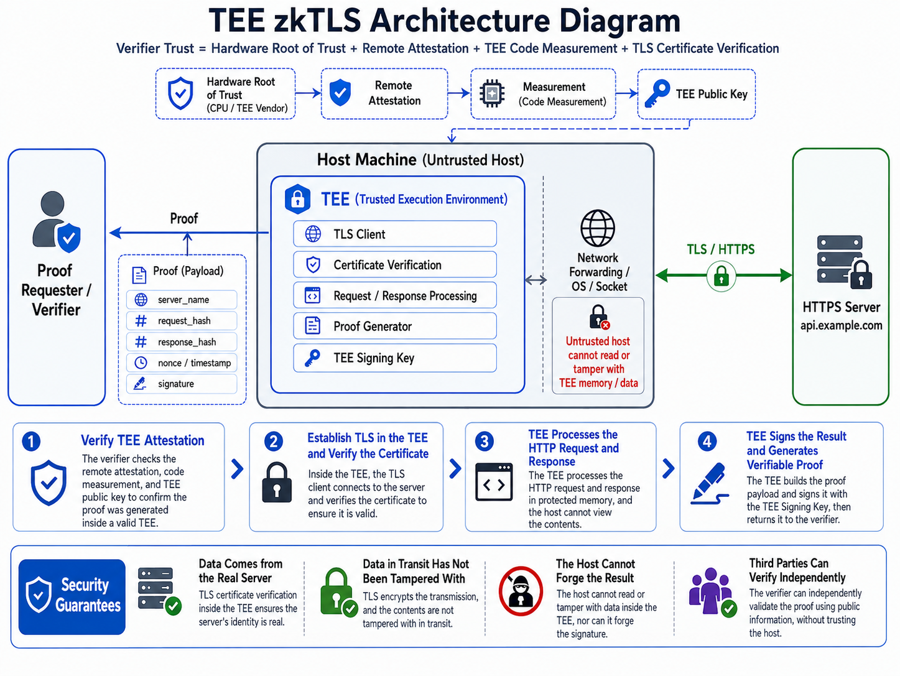

# Web Proof Technology

`Web Proof` is a general term for technologies that prove the authenticity of web data. It allows users to generate a proof that can be independently verified by a third party while visiting an ordinary HTTPS website or API, proving that certain data **genuinely came from a specific website or server and was not tampered with during transmission**.

This class of technology is also commonly referred to as `zkTLS`. One of its hallmark capabilities is that a Prover can prove they obtained specific data from a website without disclosing the full raw data to the verifier.

This technology is an ideal fit for a core problem that has long existed in AI proxy / relay services:

> **Upstream model provenance is opaque, and users cannot easily verify whether the model actually called matches what the service provider claims.**

For TokHive, Web Proof is especially important. TokHive is an open Provider network whose model services are provided by different contributors. Compared with traditional centralized services, it therefore has a greater need to address cheating behaviors such as Providers replacing upstream services or using low-cost models to impersonate high-cost ones.

That is why TokHive has built the **Web Proof verification mechanism** in as a core component from the very first architecture design stage.

---

## An Introduction to Web Proof Technology

Web Proof was first widely researched and applied in areas such as Web3, oracles, and verifiable data.

Today, mainstream implementations can be broadly divided into three technical approaches:

| Approach             | Basic Principle                                                                   | Performance | Trust Model                       |
| ------------------ | --------------------------------------------------------------------------------- | ----------: | ------------------------------- |
| **MPC-TLS**        | Client and Notary jointly participate in the TLS session through cryptographic protocols such as MPC | Slower      | Relies mainly on cryptographic security assumptions |
| **Proxy / Notary** | A Notary placed on the TLS communication path verifies or proves the TLS transcript          | Faster      | Requires an additional network path and Notary assumptions |
| **TEE**            | TLS requests, verification, and proof generation all happen inside a Trusted Execution Environment | Fastest     | Trusts hardware TEE and Remote Attestation |

Essentially, these three approaches make different trade-offs among **performance, trust assumptions, and cryptographic strength**.

---

## TokHive's Choice

TokHive adopts **TEE (Trusted Execution Environment)** as the primary implementation approach for Web Proof.

The main reasons include:

* **Performance advantages**

  Compared with MPC-TLS, TEE does not need to perform large amounts of MPC or zero-knowledge computation over the TLS encryption/decryption process. It can approach the performance of ordinary HTTPS requests, making it a better fit for AI streaming, SSE, and large-scale token request scenarios.

* **Security isolation**

  TLS keys, Provider API Keys / OAuth Tokens, and the critical verification logic can all run inside a hardware-protected trusted environment.

  Even if the Host OS, hypervisor, or an ordinary application process is compromised, protected data inside the TEE cannot be directly read.

* **Verifiability**

  TEE supports **Remote Attestation**.

  Third parties can verify:

  * Whether the expected TEE environment is currently running;
  * Whether the specified version of TokHive code is being executed;
  * Whether the proof was generated by a genuine, trusted TEE instance.

* **Cost efficiency**

  TEE does not require complex MPC or ZK computation for every TLS request, nor does it need an additional online Notary to jointly participate in TLS key computation. It is therefore better suited to high-concurrency, long-lived, and streaming AI requests.

---

## Core Principles

TokHive's Web Proof mechanism is based on:

**TLS + Trusted Execution Environment + Remote Attestation + Digital Signature**

The core idea can be summarized as:

> **Have an attestation-verified trusted program execute real HTTPS requests inside a TEE, and have the TEE generate a verifiable proof over the key request and response data.**

A typical flow looks like this:

1. TokHive's trusted program runs inside a TEE;
2. A verifier uses Remote Attestation to confirm that the TEE is running the expected version of TokHive code;
3. A TLS connection to the target AI Provider is established inside the TEE;
4. The Provider's API Key / OAuth Token is used only inside the TEE;
5. The TEE verifies the TLS connection's target domain, certificate, and request content;
6. The AI Provider returns a response;
7. The TEE generates a Proof from the request, response, and TLS session information;
8. The TEE signs the Proof with a protected key;
9. Consumers or third-party verifiers can verify the proof.

This allows a verifier to confirm:

> **The request was genuinely sent to the specified AI Provider, and the returned result came from that service, rather than being forged or substituted locally by the TokHive Provider.**

At the same time, the Provider's sensitive credentials are always confined within the trusted execution environment.

For detailed technical principles of TEE-TLS, please refer to:

[TEE-zkTLS Technical Principles](./tee-zktls-technical-principles.mdx)

---

## FAQs

### 1. Can Web Proof protect the privacy of user Prompts?

It depends on which Web Proof technical approach is adopted.

**MPC-TLS** can achieve stronger cryptographic privacy protection. For example, it allows different parties to jointly complete verification without directly obtaining the full TLS plaintext.

However, this approach requires extensive MPC computation and network interaction, with high performance overhead, and is currently not suited to the large-scale AI streaming request scenarios that TokHive targets.

TokHive's current **TEE Web Proof** approach primarily addresses two problems:

1. **Verifying the authenticity of model services**
2. **Protecting Provider API Keys / OAuth Tokens**

It is not equivalent to a cryptographic end-to-end privacy system between the Consumer and the AI Provider.

Therefore, the core goal of TokHive's current Web Proof is not to hide user Prompts, but rather:

> **To achieve Provider credential protection and AI upstream service authenticity verification while staying as close as possible to ordinary HTTPS performance.**
