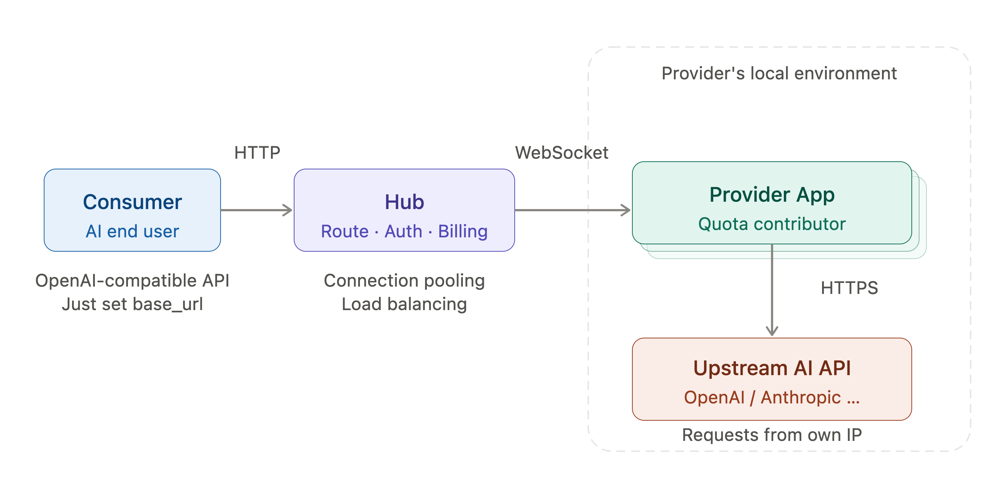

# 系统架构概览

TokHive 的整体架构由三个角色组成: **Consumer**(AI 用户)、**Hub**(中心调度服务)、**Provider**(额度贡献者).

## 请求链路

1. **Consumer** 通过标准的 OpenAI/Anthropic 兼容接口（`chat/response/message` 等）向 Hub 发送请求, 使用方式与调用原厂 API 完全一致
2. **Hub** 接收请求后, 根据 Provider 连接池的可用状态进行路由调度, 同时负责鉴权、负载均衡和用量计费
3. **Provider App** 运行在贡献者本地的 PC 或 VPC 上, 通过 WebSocket 长连接与 Hub 保持通信. 收到任务后, 使用本地存储的 OAuth Token / API Key 向上游 AI 厂商发起真实请求, 并将结果流式返回给 Hub
4. **Hub** 将响应透传给 Consumer, 完成一次完整的请求闭环

### 关键设计原则

- **Provider 自主发起请求**: 所有对上游 API 的调用都从 Provider 自身的 IP 发出, 避免因 IP 异常导致账号被上游封禁
- **密钥零暴露**: Provider 的 API Key / OAuth Token 始终留在本地, 不会明文传输给 Hub 或任何第三方. 在需要验证的环节, 密钥仅在 TEE 环境中解密使用
- **WebSocket 长连接**: Hub 与 Provider 之间采用 WebSocket 通信, 天然支持 NAT 穿透和流式响应, Provider 无需暴露公网端口

### 防作弊验证 (分阶段部署)

为了确保 Provider 返回的是来自真实上游模型的响应, 而非偷换模型或篡改内容, 我们设计了分阶段递进的验证方案:

| 阶段 | 方案 | 特点 |
|------|------|------|
| Phase 1 | Hub 持有完整 TLS 会话密钥 | 实现最简单, 快速上线, Provider 密钥会被加密上传到 Hub |
| Phase 2 | Half-MPC TLS 绑定 | 通过一次 MPC-TLS 握手后, Hub 仅获得 server_traffic_secret 用于解密验证响应, client_traffic_secret 保持秘密共享, 实现 API Key 隐私保护 |
| Phase 3 | 概率抽样 + Staking/Slashing | 仅对随机 ~5% 的请求执行 Half-MPC 验证, 配合经济激励机制(质押/罚没)形成威慑, 大幅降低验证开销 |

